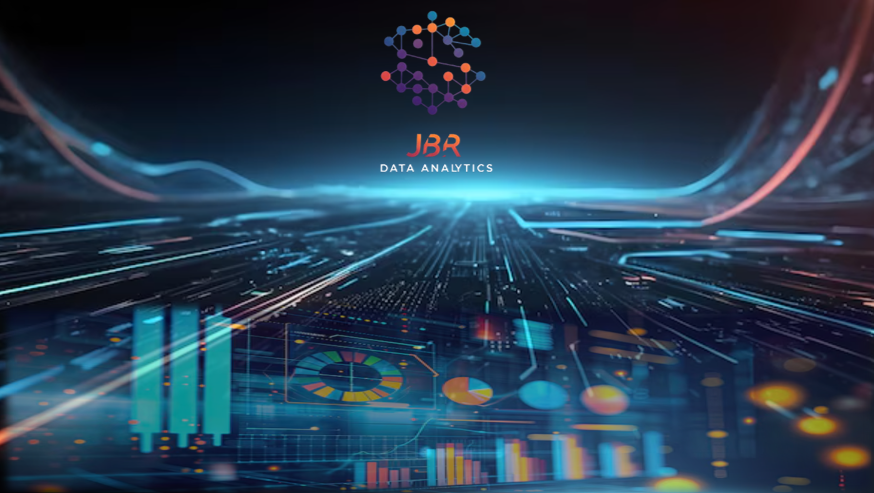
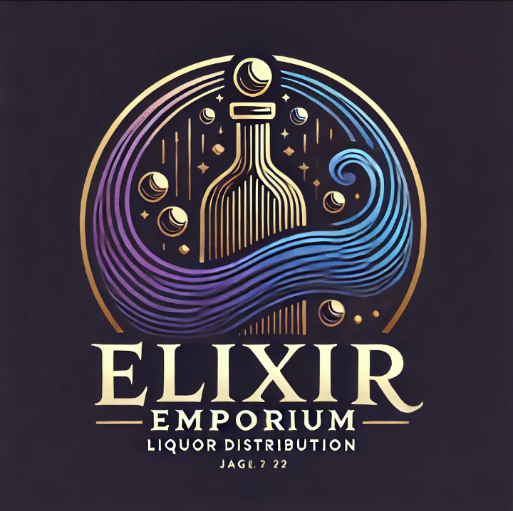
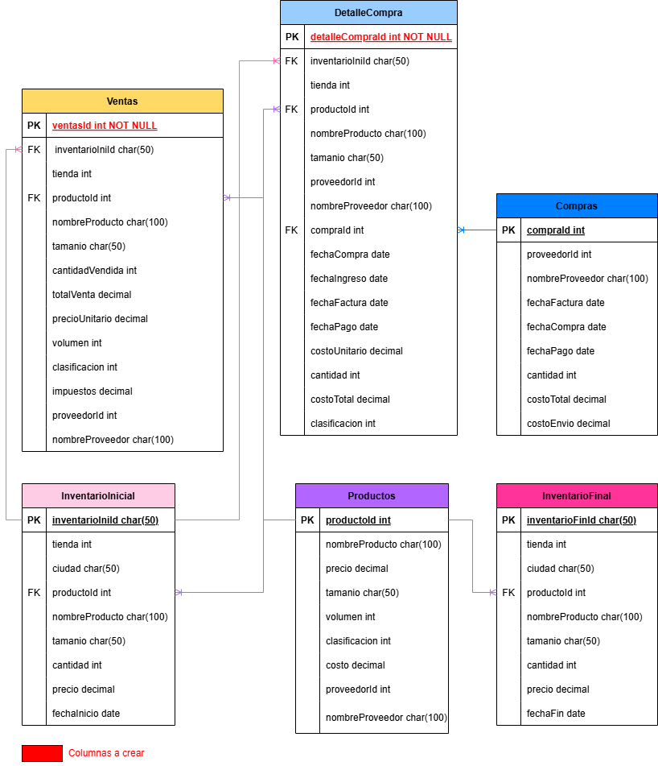

# <h1 align=center>**`Proyecto Grupal: Análisis de factibilidad de inventarios de la distribuidora de licores "Elixir Emporium"`**</h1>

_Este proyecto tiene como objetivo abordar los desafíos que enfrenta la empresa distribuidora de licores en la gestión de su inventario. Mediante el análisis de datos se pretende resolver problemas de trazabilidad y variación de precios que afectan la proyección de ventas y la gestión de inventarios._
_A través del análisis de datos históricos, herramientas como SQL Server, Python y Power BI se utilizarán para optimizar niveles de inventario, prever la demanda y mejorar la eficiencia operativa. El resultado incluirá un dashboard interactivo con insights clave para la toma de decisiones estratégicas._

## 🤝 Integrantes de JBR ANALYTICS GROUP

* 👩‍💼**Jerez Perez, Laura Daniela - Data Engineer**
* 👨‍💼**Bonilla Abello, Diego Felipe- Data Scientist**
* 👩‍💼**Rincon de Vasquez, Mariugenia Edith- Data Analyst**

##  🏢 *Datos de la empresa:* **Elixir Emporium**

### Logo

  

## 🏢 Descripción de la Empresa
_La compañía se dedica a la comercialización y distribución de una extensa variedad de bebidas alcohólicas, ofreciendo productos de reconocidas marcas nacionales e internacionales. Con una sólida red de proveedores, la empresa se encarga de abastecer tanto a pequeños establecimientos como a grandes cadenas comerciales. Actualmente, gestionan un inventario diverso que abarca desde licores premium hasta marcas más accesibles, adaptándose a las necesidades del mercado._

## 📝 Descripción del Proyecto

* 🚀 **Planteamiento del problema:**
La empresa ha estado experimentando problemas en la trazabilidad del inventario así como la variación de los precios y su impacto en las ventas, posiblemente debido a los problemas con la trazabilidad y la variación de los precios, no se han podido realizar una proyección de las ventas y/o de la rotación de inventarios.

* 🎯 **Objetivo principal:**
Analizar la trazabilidad y gestión del inventario en la distribuidora de licores mediante la implementación que permita determinar los niveles óptimos de inventario, reducir los desabastecimientos y excesos de productos.

* 🥅 **Objetivos específicos:**
✅ Determinar los niveles óptimos de inventario para los diferentes tipos de licores.
✅ Identificar oportunidades para reducir los desabastecimientos y el exceso de inventario.
✅ Analizar la rotación del inventario.
✅ Agilizar los procesos de adquisición y producción para mejorar la eficiencia.

* 📈 **Resultados Esperados:**
Con este proyecto se pretende mejorar la capacidad de rastrear y registrar el movimiento de los productos dentro del inventario. Tener visión clara sobre cómo se desplazan los productos a lo largo de la cadena de suministro, incluyendo entradas y salidas. Se intentará prever la demanda utilizando análisis de datos históricos y algoritmos predictivos.
Se espera obtener un pronóstico estimado de la demanda, adicional al indicador de rotación de inventarios y un comparativo de los precios de compra para los años 2016 y 2017.

* 📊 **Fuente de datos:**  
 📂 _2017PurchasePricesDec.csv:_ En este archivo se encuentra información relacionada con los detalles de las compras de licores realizadas en diciembre de 2017. Cada columna proporciona información específica sobre los productos, los precios y los proveedores, lo que permite analizar los costos y las características de los productos adquiridos. 

  📂 _PurchasesFINAL12312016.csv:_ Compras entregadas en el 2016, incluye la cantidad, precio unitario y total de compra.  

  📂 _SalesFINAL12312016.csv:_ Ventas realizadas en el año 2016 incluye las fechas, cantidades, total de ventas, nombre del vendedor, marca y descripción del producto. 

  📂 _InvoicePurchases12312016:_ incluye el número de la factura de la compra, el vendedor que efectuó la venta, nombre del vendedor, cantidad, transporte si incluye, valor total de la compra y las fechas de factura y de pago. 

  📂 _EndInvFINAL12312016.csv:_ Fecha en la cual sale el inventario, tienda, ciudad, marca, descripción, tamaño, cantidad y precio. 

  📂 _BegInvFINAL12312016.csv:_ Fecha en la cual ingresa a el inventario, tienda, ciudad, marca, descripción, tamaño, cantidad y precio.

## 🔄 Metodología de Trabajo
_Se realizó el trabajo con la metodología ágil siguiento en marco de Scrum. Se utilizó GitHub para el seguimiento de las actividades._  
El siguiente link, muestra el Roadmap del proyecto:
[Roadmap del proyecto](https://github.com/users/F3l1p3B0n1lla/projects/1/views/4)

## 🔲 Diagrama Entidad-Relacion

## 🛠️ Herramientas Tecnológicas Utilizadas
* GitHub   
* Git  
* Python  
* SQL Server 

